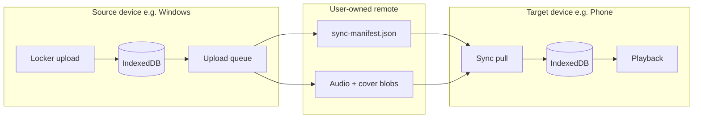

# Cross-Device Locker Sync — Scope

Goal: **upload music on Windows (or any device), then play it on your phone without the PC running.**

This document describes what exists today, the gap, proposed architecture, and phased delivery.

---

## What exists today

| Layer | Implementation | Cross-device? |
|-------|----------------|---------------|
| **Locker storage** | IndexedDB `SandboxMusicCoreDB` → `tracks` store. Audio stored as `audioBlob` + metadata. Play URLs are session `blob:` URLs. | **No** — data stays on one browser/app profile per device. |
| **Locker cache** | In-memory `lockerCache` + `LockerVaultProvider` warms on app start. | Local only. |
| **Sandbox Connect** | `ConnectClient` → WebSocket `ws://<tier34>/peer-sync?room=` relays **playback state** (title, artist, play/pause, position). Toggle: Settings → Playback Engine → **Sandbox Connect** (`sandbox_network_sync`). First enable runs **ConnectSetupWizard** (tier34 host URL, role, device name). | **No** — syncs *what is playing*, not locker files. Requires Tier 3/4 server online and devices in the same room. |
| **Tier 3/4 backend** | Optional Node server on port 3001: search, OAuth playlists, feed, DHT resolve, peer-sync relay, **locker manifest + blob API**, **background acquire worker**. | Locker blobs on server; client pulls into IndexedDB when sync enabled. |
| **Playlists** | `localStorage` keys `sandbox_layer4_playlists` + `sandbox_layer4_playlist_tombstones`; replicated via manifest `playlists[]` / `playlistTombstones[]` when Cross-device locker sync is enabled (Phase 3). | Local by default; cross-device when sync on. |
| **Android / Tauri** | Capacitor + Tauri shells load the same web client; locker still uses browser IndexedDB in WebView. | Same isolation as browser. |

**Bottom line:** Uploading in Locker always writes to **local IndexedDB first**. Cross-device replication is **opt-in** via Settings → Device Capacity → Cross-device locker sync (Phase 1 metadata; Phase 2 audio via WebDAV or Tier 3/4; Phase 3 playlist sync when enabled).

---

## Target experience

1. User uploads FLAC/MP3 on **Windows desktop** (Tauri or browser).
2. App uploads blobs + metadata to a **user-controlled remote store** (or self-hosted sync node).
3. User opens app on **phone** (Android PWA/APK).
4. Phone pulls manifest, downloads missing tracks in background, writes to local IndexedDB.
5. User plays from Locker **with PC off**.

---

## Proposed architecture

### Components

1. **Sync manifest** (`LockerSyncManifest` in `src/lockerSync.ts`)
   - Track id, content hash (SHA-256 of audio bytes), metadata, `remoteBlobUrl`, version, `updatedAt`.
   - Conflict rule (MVP): **last-write-wins** per track id; tombstone for deletes.

2. **Sync provider** (user picks in Settings → Device Capacity)
   - `none` — off (default).
   - `webdav` — Nextcloud, Synology, any WebDAV (good for self-hosters).
   - `s3` — S3-compatible (R2, B2, MinIO).
   - `tier34` — optional endpoints on Tier 3/4 server for users who already run it.

3. **Upload pipeline** (source device)
   - Hook after `saveLockerFile` / `saveLockerFilesAsAlbum` in `lockerStorage.ts`.
   - Background queue: hash blob → PUT to remote → update manifest → set `lastSyncedAt`.

4. **Download pipeline** (target device)
   - On app start + periodic: GET manifest → diff vs local IndexedDB → fetch missing blobs → `store.put` → `refreshLockerCache()`.

5. **Credentials**
   - Never in git. Per-device `localStorage` or OS secure storage (Capacitor Preferences / Tauri plugin) for WebDAV/S3 tokens.
   - F-Droid build ships with **no default remote URL**.

### What Sandbox Connect is NOT

`ConnectClient` only mirrors **now playing** across tabs/devices on the same LAN/internet **while Tier 3/4 is up**. It does **not** copy locker audio. Cross-device locker sync is a **separate feature** (manifest + blob replication).

---

## Phases

### Phase 0 — Foundation (complete)

- [x] `LOCKER_SYNC.md` (this file)
- [x] `src/lockerSync.ts` — types, settings keys, load/save, provider clients
- [x] Settings UI (Device Capacity tab) — Cross-device locker sync controls
- [x] Content-hash helper (`hashBlob`, manifest build, blob verify on pull)

### Phase 1 — MVP: metadata-only sync (functional, active)

**User value:** Same album/track list and artwork on all devices; audio still added per device.

- [x] Export/import manifest as JSON file (manual “sync” via share drive).
- [x] Optional: push/pull manifest to WebDAV `sovereign-locker/manifest.json`.
- [x] Settings: enable sync, pick provider, enter base URL.
- **Does not** require always-on server if user uses cloud drive.

### Phase 2 — MVP: selective audio sync (functional, active)

**User value:** Play on phone without PC, for chosen albums or recent uploads.

- [x] Auto-push on source after locker save (Tier34 provider + `full` mode).
- [x] Pull + download on target; store in IndexedDB (app warm + settings).
- [x] Tier 3/4 routes: `POST/GET /api/locker/manifest`, `GET/PUT /api/locker/blob/:hash`.
- [x] Background acquire worker stores blobs server-side; client polls and syncs locally.
- [x] Wi‑Fi-only toggle; storage cap respects Device Capacity setting.
- [x] Selective album sync (Locker → Albums ⋮ → Sync this album).

### Phase 3 — Full sync (playlist sync shipped; remainder partial)

**Playlist sync (functional):** `playlists[]` + `playlistTombstones[]` in `LockerSyncManifest`; merge by playlist id with union tracks; metadata conflict resolution via `updatedAt`; debounced push on local mutations (`playlistStorage.ts`); pull on app warm and Settings → Sync now. Telemetry (`playlistsImported`, `playlistsMerged`, `playlistsDeleted`, `conflictsResolved`) surfaces in Settings after sync.

**Still open:**

- [x] Background sync (focus/visibility + 5 min interval when enabled).
- [x] Delete propagation for locker track tombstones (`trackTombstones[]` in manifest).
- [x] Conflict UI for metadata edits on two devices (Settings → Device Capacity).
- [x] Playlist import auto-match from locker after sync / import.
- [ ] E2E encryption option for blobs (user passphrase).

### Phase 4 — Polish

- Native SQLite on Android for very large libraries (replace or mirror IndexedDB).
- Delta/chunked resumable uploads for FLAC.
- QR pairing for sync credentials (no typing URLs on phone).

---

## Dependencies and risks

| Risk | Mitigation |
|------|------------|
| IndexedDB size limits on mobile | Stream downloads; respect capacity setting; warn before sync |
| WebView blob URL churn | Already handled by `refreshLockerEntryPlayUrl`; same for synced blobs |
| F-Droid policy | No bundled private URLs; user supplies own storage |
| Battery / data | Wi‑Fi-only default; explicit “sync now” button in MVP |
| Legal | User-owned files only; sync is user-controlled infrastructure |

---

## Files to touch (implementation map)

| File | Role |
|------|------|
| `src/lockerStorage.ts` | Upload hooks, hash on save, import synced blob |
| `src/lockerSync.ts` | Settings, manifest types, provider clients |
| `src/playlistStorage.ts` | Local playlists; debounced manifest push when sync enabled |
| `src/stations/SettingsView.tsx` | Sync provider UI |
| `tier34-server/index.ts` | Optional locker blob routes (Phase 2) |
| `src/LockerVaultContext.tsx` | Trigger pull on warm |
| `LOCKER_SYNC.md` | Scope / status |

---

## Settings keys

| Key | Purpose |
|-----|---------|
| `sandbox_locker_sync_settings` | JSON `LockerSyncSettings` |
| `sandbox_layer4_playlists` | Local playlist store (synced via manifest when enabled) |
| `sandbox_layer4_playlist_tombstones` | Deleted playlist ids + `deletedAt` for cross-device replication |
| `sandbox_network_sync` | Existing peer **playback** sync (unchanged) |

---

## Status

**Phase 1 and Phase 2 are functional and active** in this repo. Settings → Device Capacity → **Cross-device locker sync** exposes a live UI (export/import, WebDAV push/pull, provider selection, Wi‑Fi-only and selective-album toggles).

**Phase 1 (metadata):** `exportLockerManifest` / `importLockerManifest` (file or WebDAV). Merges track metadata by id; does not copy audio blobs.

**Phase 2 (audio blobs):**
- **WebDAV:** manifest push/pull in Settings UI; blob GET/PUT under `sovereign-locker/blobs/{hash}` in `lockerSync.ts` (pull on app warm when provider is WebDAV + mode `full`).
- **Tier 3/4:** locker manifest/blob API on port 3001; client auto-push after `saveLockerBlob` when provider is `tier34` + mode `full`; `pullMissingLockerBlobsFromRemote` on app warm (`LockerVaultContext`). Catalog downloads run on tier34 acquire worker; client polls `/api/acquire/status/:jobId` and pulls blobs into IndexedDB.

**Phase 2.5 (Resilience):** SQLite `job_queue` persists acquire/heal jobs across tier34 restarts. GET `/api/locker/blob/:hash` verifies SHA-256 on disk; corrupt blobs are quarantined and auto-healed via `heal-blob` jobs. Optional Meilisearch index (`tracks`) for fast locker search — start `meilisearch` separately on port 7700, then `POST /api/search/reindex`.

**Quick start (Tier 3/4 audio sync):** Settings → Device Capacity → enable Cross-device locker sync → provider **Self-hosted Tier 3/4** (mode **full**; set `remoteBaseUrl` if tier34 is not `http://localhost:3001`). Run `npm run dev:tier34` on the sync host.

**Phase 3 (functional):** Track delete tombstones, background sync (5 min + focus/visibility), metadata conflict panel, and playlist stub auto-match from locker after sync. E2E blob encryption remains future work.
