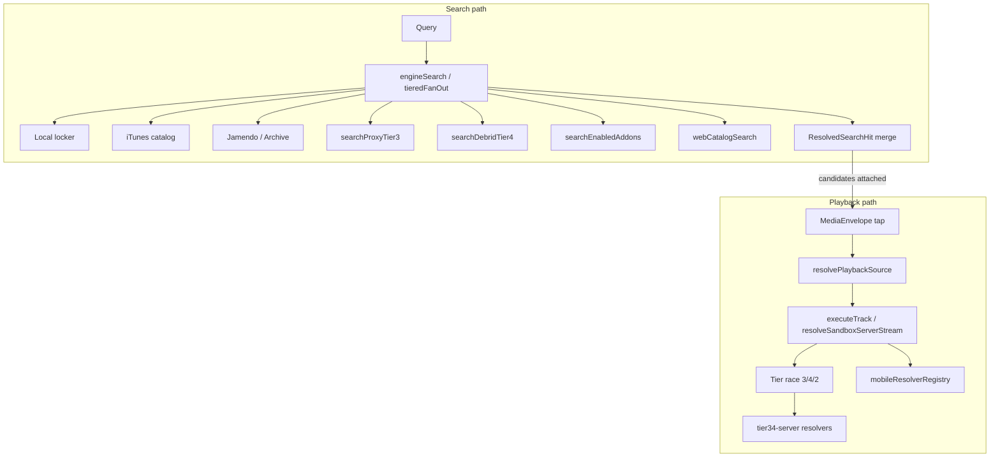

# Pass 2 — Provider System & Model Routing Analysis

Subsystem: **Provider System & Model Routing** (canonical paths: `src/playbackPipeline.ts`, `src/hybridResolution.ts`, `src/addons/searchProviders.ts`, `src/sandboxLayer2.ts`, `src/mobileResolverRegistry.ts`, `src/fidelityPolicy.ts`, `tier34-server/lib/{proxyResolve,debridResolve,addonResolve,search,sandboxIndexer}.ts`). **Code-only audit — 2026-07-21.**

---

## Subsystem boundary

| In scope | Module names in code | Role |
|----------|---------------------|------|
| **Playback resolve routing** | `playbackPipeline.ts`, `hybridResolution.ts` | Tier-ordered URL resolution before audio load |
| **Search provider fleet** | `sandboxLayer2.ts` (`tieredFanOut`, `engineSearch`) | Multi-provider search fan-out and identity merge |
| **Tier34 client adapters** | `addons/searchProviders.ts`, `tier34/client.ts` | HTTP bridge to Sandbox Server resolve/search APIs |
| **Server-side resolvers** | `tier34-server/lib/proxyResolve.ts`, `debridResolve.ts`, `addonResolve.ts`, `search.ts`, `sandboxIndexer.ts` | yt-dlp, Invidious, Piped, archive.org, iTunes preview, Real-Debrid, addon backends |
| **Mobile providers** | `mobileResolverRegistry.ts`, `ytDlpMobile.ts` | On-device resolve registry (builtin yt-dlp + HTTPS manifests) |
| **Policy & credentials** | `fidelityPolicy.ts`, `playbackEngineSettings.ts`, `sandboxSettings.ts`, `catalogDirect.ts` | Fidelity gating, Prowlarr/RD keys, experimental toggle, preview dev mode |
| **Observability** | `tierResolutionLog.ts` | In-memory tier hit/miss log for Settings → Signal Bench |

| Out of scope | Reason |
|--------------|--------|
| `sandboxLayer1.ts` audio FSM | Playback engine, not source selection |
| `src/play/*` | Queue advance orchestration (see `playback-queue-analysis.md`) |
| `unifiedSearch.ts` | Locker + catalog UI search ranking; delegates catalog to `searchCatalog`, not tier resolve |
| `tier34-server/lib/meilisearchIndexer.ts` | Locker full-text **indexer**, not playback provider routing |
| `albumCoverProviders.ts` | Metadata/artwork providers only |
| `server.ts` Gemini routes | Playlist curation / metadata lookup — not playback provider routing |

**Naming note:** The codebase does not use a `Provider` class hierarchy. The term appears as `MediaProvider` (union type), `SearchProviderId` (search feedback EMA), `searchProviders.ts` (tier34 HTTP adapters), and the `sandboxLayer2` header comment "provider fleet."

---

## Subsystem Interface

### Inputs

| Input | Source | Handler / module |
|-------|--------|------------------|
| `MediaEnvelope` + optional `CandidateSource[]` | Play tap, prefetch, cast resolve | `executeTrack` (`playbackPipeline.ts`), `resolvePlaybackSource` (`hybridResolution.ts`) |
| Search query string | Search station, album drill | `engineSearch` → `tieredFanOut` (`sandboxLayer2.ts`) |
| Sandbox Server base URL | Settings | `getTier34BaseUrl()` (`tier34/client.ts`) |
| Prowlarr / Real-Debrid / Discogs credentials | Settings → Playback Engine | `loadPlaybackEngineSettings()` → `searchDebrid`, `tier34IndexerSearch` |
| Fidelity policy (`STANDARD` / `HIGH` / `LOSSLESS`) | Settings → Audio Fidelity | `loadFidelityPolicy()` → `fidelityPolicy.ts`, `buildTierSteps` / `pickBestPlayCandidate` |
| Experimental integrations toggle | Settings → Addons | `loadShowExperimentalIntegrations()` → builtin addon pack |
| Enabled user addon manifests | `addonStorage.ts` | `searchUserManifestAddons`, `getEnabledAddons` |
| Mobile resolver enablement + manifests | Settings / prefs | `mobileResolverRegistry.ts` |
| Air-gap mode flag | Settings | `isAirGapEnabled()` gates remote tier34 calls |
| Album hint / chart query flags | Search UI context | `tieredFanOut` album mode, `isChartQuery` |

### Outputs

| Output | Consumer |
|--------|----------|
| Resolved `MediaEnvelope` with playable `url`, `provider`, `transport` | `sandboxLayer1` audio FSM, native Exo, cast |
| `ResolvedPlaybackSource` (`source`: locker/cache/server/mobile/preview) | `envelopeFromResolved`, player bar badge |
| `ResolvedSearchHit[]` with merged `sources` | Search results UI, play candidates attachment |
| `CandidateSource[]` from tier34 POST resolve | Scoring in `sandboxLayer2`, `pickBestPlayCandidate` |
| Tier resolution log entries | Settings Signal Bench (`tierResolutionLog.ts`) |
| Stream/play URL session caches | `playUrlCache.ts`, `streamCache.ts` |

### State changes

- **In-memory:** `playUrlCache` (30 min TTL, 120 entries), `streamCache` (mobile/server URIs), `tierResolutionLog` (80 entries), `sandboxLayer2` `searchCache` LRU (200 entries, 5 min), `FeedbackStore` EMA reliability scores, `mobileResolverRegistry` Map, server `resolvedStreamCache` in `proxyResolve.ts` (10 min).
- **localStorage / prefs:** `sandbox_last_resolved_source_v1`, playback engine secrets, addon install state, mobile resolver enabled IDs, fidelity/experimental settings.
- **Server filesystem:** `tier34-server` `indexer-config.json` (Torznab endpoints).

### External dependencies

| Dependency | Role |
|------------|------|
| Sandbox Server `:3001` | `/api/proxy/resolve`, `/api/debrid/resolve`, `/api/addon/*`, `/api/proxy/stream`, `/api/indexer/search`, `/api/dht/resolve` |
| `yt-dlp` (host CLI or Android native) | Tier 3 stream extraction |
| Invidious / Piped public instances | YouTube search/stream fallback (`proxyResolve.ts` hardcoded instance lists) |
| archive.org | Tier 3/4 search and debrid FLAC fallback |
| iTunes Search API | Catalog metadata + 30s previews (`searchCatalogProvider`, `search.ts`) |
| Jamendo API | Optional search provider (`VITE_JAMENDO_CLIENT_ID`) |
| Real-Debrid REST API | Tier 4 magnet/link unrestrict (`debridResolve.ts`) |
| Prowlarr / Torznab | Optional indexer (`sandboxIndexer.ts`, `debridResolve.ts`) |
| SoundCloud, Audius, Radio Browser, Soulseek/slskd | Experimental addon resolves (`addonResolve.ts`) |
| User HTTPS addon manifests | Arbitrary search endpoints (client-side HTTPS validation) |

### Called by

- `sandboxLayer3.tsx` — play handler calls `executeTrack` via playback pipeline
- `sandboxLayer2.ts` — search station via `engineSearch`
- `trackPrefetch.ts` — upcoming queue prefetch resolve
- `webCatalogSearch.ts` — supplements catalog with `searchProxy` / yt-dlp mobile
- `castStreamResolver.ts` — stream URL for cast
- `stations/SettingsView.tsx` — engine status, addon configuration (inferred from imports in deps graph)

### Calls into

- `sandboxLayer1.resolveMediaEnvelope` — candidate → envelope conversion
- `tier34/client.ts` — `tier34Fetch`, health cache, DHT resolve, indexer search
- `lockerStorage.ts` — local vault candidates (search local path)
- `searchCatalog.ts` / `catalogFetch.ts` — iTunes catalog metadata
- Native: `ytDlpMobile.ts`, `nativeExoStreamResolver.ts` — mobile resolve and file URL reachability

### Persistence

- **Play URL cache:** session-scoped `Map` in `playUrlCache.ts` (not `sessionStorage`).
- **Last resolved source:** `localStorage` key `sandbox_last_resolved_source_v1` (`hybridResolution.ts`).
- **Search LRU:** in-memory only (`sandboxLayer2.searchCache`).
- **Tier resolution log:** in-memory only; cleared on reload.
- **Indexer config:** `tier34-server` persistent JSON on server disk.
- **Credentials:** `localStorage` + encrypted secrets via `securitySettings.ts` (`playbackEngineSettings.ts`).

### Threading / async behaviour

- All provider I/O is async `fetch` / `Promise` based; no Web Workers in resolve path.
- **Parallelism:** `raceTierHits` races tier steps (proxy, debrid, addons) — first hit wins; losers not aborted. `firstResolvedTierQuery` races multiple yt-dlp query strings (18s deadline). `tieredFanOut` uses `Promise.allSettled` for catalog/jamendo/archive, then proxy/debrid/web, then addons.
- **Timeouts:** `TIER_TIMEOUT_MS` = 10s per tier step; addon POST 12–14s `AbortController`; web search up to 75–90s (`webCatalogSearch.ts`).
- **Mobile:** `tryMobileResolve` serializes enabled resolvers; caches via `streamCache`.
- **Server:** `spawnYtdlp` child processes with per-invocation timeouts; stream URL cache avoids re-extract on Range requests.

```yaml
evidence:
  files:
    - src/playbackPipeline.ts
    - src/hybridResolution.ts
    - src/addons/searchProviders.ts
    - src/sandboxLayer2.ts
    - src/mobileResolverRegistry.ts
    - src/tier34/client.ts
    - tier34-server/lib/proxyResolve.ts
    - tier34-server/index.ts
  symbols:
    - executeTrack
    - resolvePlaybackSource
    - tieredFanOut
    - raceTierHits
    - resolveProxyCandidates
    - searchDebrid
  confidence: High
  evidence_type:
    - implementation
counter_evidence:
  files_inspected:
    - src/unifiedSearch.ts
    - tier34-server/lib/meilisearchIndexer.ts
  note: Meilisearch indexes locker blobs for search UI — not tier playback routing
```

---

## Verified Facts (Only statements directly supported by code)

1. **Hybrid playback resolve order is fixed:** locker → stream cache → Sandbox Server tiers → mobile resolvers → catalog preview (`HYBRID_RESOLUTION_ORDER` in `hybridResolution.ts`). Android with active mobile resolvers may run mobile **before** cache/server (`androidMobileFirst` branch).

```yaml
evidence:
  files:
    - src/hybridResolution.ts
  symbols:
    - HYBRID_RESOLUTION_ORDER
    - resolvePlaybackSource
    - androidMobileFirst
  confidence: High
  evidence_type:
    - implementation
```

2. **Playback tier steps are numbered 2–4 in `playbackPipeline.ts`:** tier 2 = experimental/user addons; tier 3 = proxy (`searchProxy`); tier 4 = debrid (`searchDebrid`) + DHT mesh fallback. Under `LOSSLESS` policy, debrid is tried sequentially before racing proxy/addons.

```yaml
evidence:
  files:
    - src/playbackPipeline.ts
  symbols:
    - buildTierSteps
    - resolveTiersForQuery
    - resolveDhtMesh
  confidence: High
  evidence_type:
    - implementation
```

3. **Server-side tier 3 resolve chain:** yt-dlp → Invidious → Piped → archive.org/iTunes fallback (`resolveProxyCandidates` in `tier34-server/lib/proxyResolve.ts`).

```yaml
evidence:
  files:
    - tier34-server/lib/proxyResolve.ts
  symbols:
    - resolveProxyCandidates
    - ytdlpResolve
    - invidiousResolve
    - pipedResolve
  confidence: High
  evidence_type:
    - implementation
```

4. **Client `searchProviders.ts` maps tiers to tier34 HTTP routes:** `POST /api/proxy/resolve`, `POST /api/debrid/resolve`, `POST /api/addon/*/resolve`, plus optional `tier34IndexerSearch` → `GET /api/indexer/search`.

```yaml
evidence:
  files:
    - src/addons/searchProviders.ts
    - src/tier34/client.ts
    - tier34-server/index.ts
  symbols:
    - searchProxy
    - searchDebrid
    - searchBuiltinPackAddons
    - tier34IndexerSearch
  confidence: High
  evidence_type:
    - api
```

5. **Search orchestration (`tieredFanOut`) fans out:** local locker → iTunes catalog → Jamendo → archive.org (parallel), then proxy tier 3 + debrid tier 4 + web supplement (parallel, unless album/chart/catalogOnly mode), then enabled addons (tier 2).

```yaml
evidence:
  files:
    - src/sandboxLayer2.ts
  symbols:
    - tieredFanOut
    - searchProxyTier3
    - searchDebridTier4
    - searchEnabledAddons
  confidence: High
  evidence_type:
    - implementation
```

6. **`MediaProvider` is a string union (not a class)** covering vault, proxy, debrid, P2P, catalog, and `gemini-curate` — defined in `sandboxLayer1.ts`.

```yaml
evidence:
  files:
    - src/sandboxLayer1.ts
  symbols:
    - MediaProvider
    - CandidateSource
    - MediaEnvelope
  confidence: High
  evidence_type:
    - implementation
```

7. **No LLM-based provider or model routing exists in playback/search resolve paths.** `@google/genai` is imported only in `server.ts` for `/api/playlist-curate` and metadata lookup helpers. Client playlist prompt curation (`curatePlaylistFromPrompt.ts`) optionally calls server Gemini but does not select playback providers.

```yaml
evidence:
  files:
    - server.ts
    - src/curatePlaylistFromPrompt.ts
  symbols:
    - GoogleGenAI
  confidence: High
  evidence_type:
    - implementation
counter_evidence:
  grep:
    pattern: "@google/genai|OpenAI|model routing"
    scope: src/
    hits_in_playback_pipeline: 0
  note: MediaProvider includes gemini-curate for playlist feature typing only
```

8. **Catalog preview playback is dev-gated:** `allowCatalogPreviewPlayback()` returns true only when experimental integrations are on or `sandbox_catalog_preview_dev=1` pref is set (`catalogDirect.ts`). Production default strips preview URLs from catalog envelopes via `catalogPlayUrlFromPreview`.

```yaml
evidence:
  files:
    - src/catalogDirect.ts
  symbols:
    - allowCatalogPreviewPlayback
    - catalogPlayUrlFromPreview
    - canResolveFullStreams
  confidence: High
  evidence_type:
    - implementation
```

9. **Candidate ranking for playback uses fidelity policy + dice coefficient title/artist matching + provider rank ladder** (`local-vault` 100 > `stream-cache` 90 > `debrid` 80 > `proxy` 70 > P2P 65 > preview 10).

```yaml
evidence:
  files:
    - src/playbackPipeline.ts
    - src/fidelityPolicy.ts
  symbols:
    - pickBestPlayCandidate
    - candidatePlayRank
    - fidelityAllowsCandidate
  confidence: High
  evidence_type:
    - implementation
```

10. **User manifest addons fetch manifest JSON from user-supplied HTTPS URLs** and call `search.endpoint` directly from the browser (`fetchManifestSearch` in `searchProviders.ts`), guarded by `isAllowedAddonSearchEndpoint`.

```yaml
evidence:
  files:
    - src/addons/searchProviders.ts
    - src/addons/addonUrlValidation.ts
  symbols:
    - searchUserManifestAddons
    - isAllowedAddonSearchEndpoint
  confidence: High
  evidence_type:
    - implementation
```

---

## Architectural Interpretation

### Tier model (as implemented)

The codebase uses a **numeric tier convention** that differs between search metadata and playback resolve:

| Tier | Playback (`buildTierSteps`) | Search (`tieredFanOut` priorities) | Typical sources |
|------|---------------------------|-----------------------------------|-----------------|
| 0–1 | (implicit locker/cache in hybrid pipeline) | Local locker (`searchLocal`, priority 0) | IndexedDB vault |
| 2 | Addon builtin + user manifests | Addon candidates (priority 4) | SoundCloud, WebTorrent, user HTTPS addons |
| 3 | `proxy` | Proxy search results (priority 5) | yt-dlp, Invidious, Piped, archive, iTunes preview |
| 4 | `debrid` + DHT | Debrid search results (priority 6) | Sandbox Indexer, Real-Debrid, archive FLAC |

Catalog/iTunes rows are **metadata-first**: they populate search UI with preview URLs (when dev-allowed) but full streams are obtained only at play time through tier 3/4/mobile resolve.

### Two pipelines, one provider fleet



Search path optimizes for **breadth and progressive UI** (`onPartial` callbacks). Playback path optimizes for **single-track correctness** (catalog identity checks, caching, proxy wrapping).

### "Model routing" assessment

**Confidence: High** — there is no multi-model LLM router. The audit scope name maps to:

- **Media provider routing** (implemented, extensive)
- **AI model routing** (not implemented for playback/search; Gemini is a standalone playlist/metadata service on `server.ts`)

---

## Engineering Assessment

### Strengths

- **Clear separation** between search fan-out (`sandboxLayer2`) and play-time resolve (`playbackPipeline` + `hybridResolution`), with shared adapters in `searchProviders.ts`.
- **Catalog identity guards** (`resolvedStreamMatchesCatalog`, `preserveTappedEnvelopeIdentity`) reduce wrong-track playback from fuzzy tier hits.
- **Policy hooks** (fidelity, air-gap, experimental gating, offline mobile-first) are centralized and readable.
- **Server stream cache** (`proxyResolve.ts`) avoids yt-dlp re-entry on ExoPlayer Range requests.
- **Defense in depth for addon manifests** (HTTPS-only, SSRF host blocklist).

### Weaknesses / risks

1. **First-wins parallel tier racing without cancellation** — Under `STANDARD`/`HIGH` fidelity, `raceTierHits` may return a fast proxy hit while a slower debrid resolve would have been higher quality. **Confidence: High.** **Violation risk: Medium.**

2. **Wrong-track playback from identity bypass and fuzzy thresholds** — Mobile resolves skip catalog metadata matching; dice coefficients and duration ratios may still admit near-miss YouTube results for short or ambiguous titles. **Confidence: High.** **Violation risk: High.**

3. **Hardcoded third-party instance dependencies** — Invidious/Piped base URLs in `proxyResolve.ts` are public community instances with no health rotation beyond try-next. **Confidence: High.** **Violation risk: Medium.**

4. **Credentials forwarded from browser to tier34** — Prowlarr/RD keys in POST JSON require trusting the Sandbox Server transport and host. **Confidence: High.** **Violation risk: High** if tier34 is exposed beyond trusted LAN.

5. **Air-gap incomplete on client-direct providers** — `searchArchive` and `searchCatalogProvider` call archive.org/iTunes directly without `isAirGapEnabled()` checks, unlike tier34-gated paths. **Confidence: High.** **Violation risk: Medium** for strict air-gap deployments.

6. **Subsystem spread / naming drift** — Provider logic spans Layer 2, playback pipeline, addons, tier34 lib, and mobile registry with overlapping tier numbers and duplicate `searchProxy`/`searchDebrid` exports (`sandboxLayer2` re-exports tier3/4 wrappers calling `searchProviders`). Onboarding cost is high. **Confidence: High.** **Violation risk: Low** (maintainability).

7. **No LLM model routing** — Not a defect; documented for scope clarity. Playlist Gemini path is unrelated to stream provider selection. **Confidence: High.**

### Unknown / not verified in this pass

- Runtime behavior of Soulseek/slskd addon under load (**Confidence: Unknown** — route handlers present; worker integration not traced).
- Whether `engineSearch` `catalogOnly` mode is used in all search UI entry points (**Confidence: Medium** — option exists; not all call sites verified).
- Full list of `executeTrack` call sites enforcing `isPlaybackDowngrade` (**Confidence: Medium** — function exported; caller audit incomplete).

---

## Top 3 risks (summary)

| # | Risk | Confidence | Severity |
|---|------|------------|----------|
| 1 | **Wrong-track playback** from parallel tier racing + fuzzy match bypass on mobile resolution | High | High |
| 2 | **Debrid/Prowlarr credentials** sent from client to tier34; trust boundary is the self-hosted server | High | High |
| 3 | **Fragile tier-3 upstreams** (hardcoded Invidious/Piped instances, yt-dlp availability) causing silent resolve failures | High | Medium |

---

## Paths written

- `C:\Users\RH\Downloads\sovereign-music-console\docs\audit\provider-invariants.md`
- `C:\Users\RH\Downloads\sovereign-music-console\docs\audit\provider-analysis.md`
