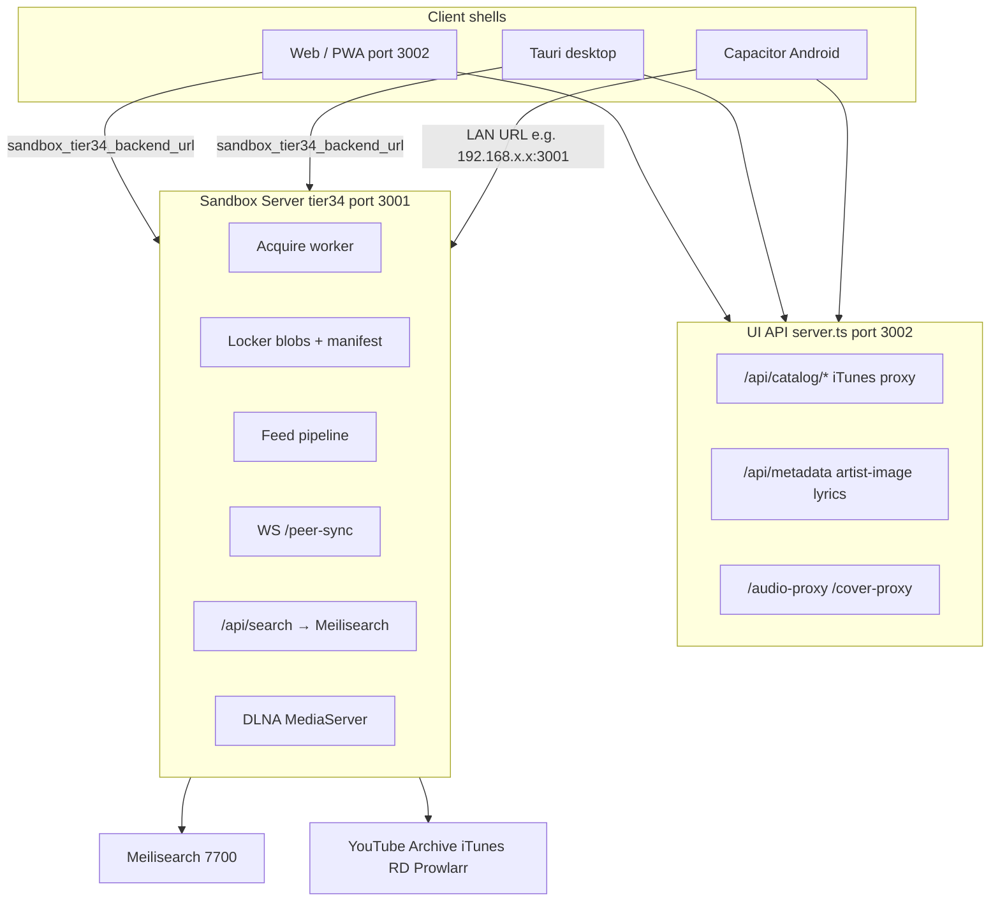
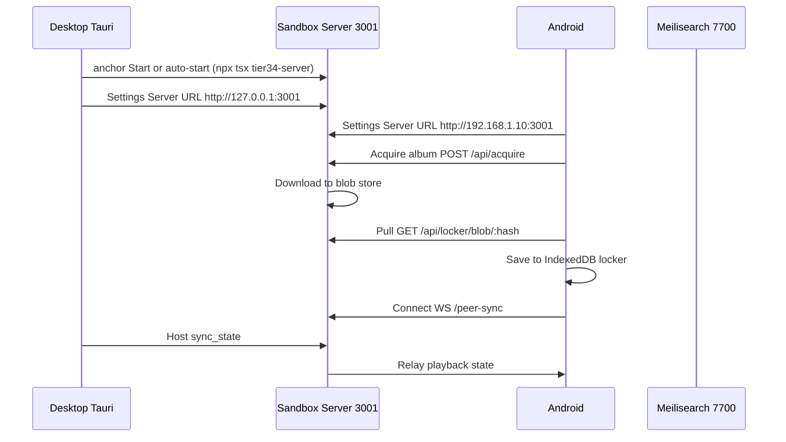

> ⚠️ Sections 4, 5, and 10 describe the development path only. Packaged Tauri desktop bundles tier34-server.mjs — see docs/audit/launcher-analysis.md for verified facts.

# Sandbox Architecture

How **Sandbox Server**, the UI shell, **Sandbox Builder**, and **Sandbox OS** fit together in Sovereign Music Console.

Last updated: 2026-06-12.

## Naming map

| User-facing name | Code / doc name | What it is |
|------------------|-----------------|------------|
| **Sandbox Server** | `tier34-server`, Tier 3/4 backend | Node/Express API on **port 3001** |
| **Tier34** | `src/tier34/`, sovereign status | Same server; “tier” = extraction/search fidelity |
| **UI server** | `server.ts` | Dev/prod shell + metadata proxies on **port 3002** |
| **Sandbox Builder** | Future station (scaffold only) | Not shipped in this repo |
| **Sandbox OS** | Layer 1/2/3 + Tauri infrastructure | Client runtime, not a separate OS binary |

---

## 1. Sandbox Server (tier34)

The **Sovereign extraction node** — a self-hosted Node server beside the React UI. It handles work the browser should not do alone: yt-dlp proxy streams, catalog acquire jobs, locker blob storage, Meilisearch indexing, DLNA, cast discovery, Feed pipeline, OAuth bridges, and Connect WebSocket relay.

| Item | Value |
|------|-------|
| Entry | `tier34-server/index.ts` |
| Default URL | `http://localhost:3001` |
| Health | `GET /health` → `{ ok, meilisearch, ytdlp, features: [...] }` |
| Settings label | **SANDBOX SERVER** (`src/sovereignSystemStatus.ts`) |

### Ports and related services

| Port | Service | Role |
|------|---------|------|
| **3001** | Sandbox Server (tier34) | Acquire, locker blobs, search proxy, Feed, Connect WS, DLNA, cast |
| **3002** | `server.ts` | Vite UI + catalog/metadata proxies (iTunes, artist images, lyrics) |
| **7700** | Meilisearch (optional) | Full-text locker search; tier34 proxies via `/api/search` |
| **9696** | Prowlarr (optional, external) | Tier 4 debrid indexer |
| UDP 1900 | SSDP (when DLNA enabled) | LAN TV/receiver discovery |

### API surface (grouped)

| Area | Examples |
|------|----------|
| Health / status | `GET /health` |
| Tier 3 proxy | `GET /api/search/proxy`, `POST /api/proxy/resolve`, `GET /api/proxy/stream` |
| Tier 4 debrid | `GET /api/search/debrid`, `POST /api/debrid/resolve` |
| Acquire | `POST /api/acquire`, `GET /api/acquire/status/:jobId` |
| Locker sync | `GET/POST /api/locker/manifest`, `GET/PUT /api/locker/blob/:hash` |
| Device secrets | `GET/PUT /api/device/secrets` — cross-device API key sync |
| Locker search | `GET /api/search`, `POST /api/search/reindex` |
| Feed / discovery | `GET /api/feed`, `POST /api/mixes`, `GET /api/videos` |
| Connect | `WS /peer-sync?room=` |
| Cast / DLNA | `/api/cast/*`, DLNA routes when `DLNA_MEDIASERVER=1` |
| Ingestion | `GET/POST /api/ingestion/watch` |
| OpenSubsonic | `GET /rest/*` (read-only: folders, search, albums, stream, cover art) |
| Addons | SoundCloud, WebTorrent, IPFS, Radio Browser, Audius |
| OAuth | `GET /api/oauth/:provider/authorize`, `GET /api/oauth/playlists` |
| Analysis | spectral, fingerprint, stem failover, sonic-dna, dht, heal |

Full endpoint table: [TIER34.md](../TIER34.md).

### Environment variables (tier34 host)

| Variable | Default | Purpose |
|----------|---------|---------|
| `TIER34_PORT` | `3001` | Listen port |
| `TIER34_CORS_ORIGIN` | `http://localhost:3002` | Allowed UI origin when defense protocol on |
| `TIER34_DEFENSE_PROTOCOL` | `true` | Restrict CORS and outbound proxy targets |
| `TIER34_STORAGE_PATH` | `tier34-server/storage/` | Locker blob root on server |
| `TIER34_WATCH_PATH` | — | Folder watch import path |
| `SUBSONIC_USER` / `SUBSONIC_PASSWORD` | `sandbox` / `sandbox` | OpenSubsonic auth (token or plain password) |
| `SUBSONIC_BASE_URL` | — | Public base URL for stream paths (LAN IP for phones) |
| `SUBSONIC_API_ENABLED` | `true` | Disable with `false` |
| `MEILISEARCH_URL` | `http://localhost:7700` | Meilisearch host |
| `MEILISEARCH_API_KEY` | — | Optional auth |
| `PROWLARR_URL` / `PROWLARR_API_KEY` | localhost:9696 | Debrid indexer |
| `REALDEBRID_API_KEY` | — | Tier 4 unrestrict |
| `YTDLP_PATH` | auto-detect | Full YouTube/audio streams |
| `DLNA_MEDIASERVER` | off | Enable UPnP MediaServer |
| `DLNA_BASE_URL` | — | LAN IP for TVs (required for DLNA) |
| `SPOTIFY_*`, `OAUTH_REDIRECT_URI` | — | OAuth bridges |
| `TIER34_DEVICE_SYNC_SECRET` | — | Optional shared secret for `GET/PUT /api/device/secrets` |

Copy `.env.example` to `.env` and adjust. Docker stack: `docker-compose.yml` (tier34 + Meilisearch).

### Cross-device API key sync

When **Sync keys via Sandbox Server** is enabled (Settings → Security), the client pushes acquisition and scrobble secrets to the tier34 host on save and pulls on startup / server URL change. Stored as `device-secrets.json` under the locker storage root (`TIER34_STORAGE_PATH`).

**Synced keys:** Real-Debrid, Prowlarr URL + API key, Last.fm API key + session + username, ListenBrainz token, scrobble toggles, OAuth token, SoundCloud/Audius addon config.

**Not synced:** device fingerprints, Connect device IDs, locker audio blobs.

**Auth:** `X-Sandbox-Client` required. If `TIER34_DEVICE_SYNC_SECRET` is set on the server, clients must send matching `X-Tier34-Device-Sync` or `X-Sandbox-Token`. Without the env var, LAN clients with a valid Sandbox client header are trusted (self-hosted model).

**Merge:** Per-key `updatedAt` timestamps — newer local values are not overwritten on pull; empty local slots accept remote values.

**Android TV / Shield:** Same pull/push path as phone and desktop. Set the Sandbox Server Remote URL once on the TV (Settings → Addons, or configure on phone/Windows and match the same LAN IP or overlay address on TV). Keys entered on any other client sync via tier34 — the TV does not need to re-enter acquisition keys if **Sync keys via Sandbox Server** is enabled (default ON when using a non-localhost Remote URL).

Implementation: `src/deviceSecretSync.ts`, `tier34-server/lib/deviceSecrets.ts`.

### How the client finds the server

All tier34 HTTP calls use `getTier34BaseUrl()` in `src/tier34/client.ts`, which reads **`sandbox_tier34_backend_url`** from prefs/localStorage.

- **Web dev** (`npm run dev` on 3002): defaults to `http://localhost:3001` if URL empty.
- **Tauri / Capacitor (Android)**: default is **empty** until user configures a URL (no bundled tier34 in the app package). iOS/macOS native targets are planned for a future release.

---

## 2. UI server (`server.ts`)

Port **3002** — the Vite dev server and production shell. Serves the React app and lightweight metadata proxies. **Not** a substitute for Sandbox Server.

| Route area | Role |
|------------|------|
| `/api/catalog/*` | iTunes catalog proxy |
| `/api/metadata/*`, `/api/artist-image` | Artist images (TheAudioDB), lyrics |
| `/audio-proxy`, `/cover-proxy` | Stream/cover passthrough |
| Static `dist/` | Production bundle (Tauri embeds the same build) |

Desktop README note: run the Node API separately for full catalog/Gemini routes; tier34 is always a separate process (`npm run dev:tier34` or Docker).

---

## 3. Sandbox Builder

**There is no Sandbox Builder app or module in this repository.** References are future ecosystem placeholders:

- `docs/INFRASTRUCTURE.md` — shared by Music, **Builder**, Reef, Vault, AI, and future stations
- `src-tauri/src/infrastructure/event_bus.rs` — event channel name `builder`
- `src-tauri/src/infrastructure/sandbox_runtime.rs` — WASM plugin sandbox for Builder, Reef, and station extensions

**Planned role:** a separate **station** running sandboxed WASM plugins via Wasmtime, with capability flags (filesystem, network, DB, AI) — same Tauri infrastructure registry as Music.

**Today:** scaffold only; no Builder UI, routes, or npm package. Music (`sandboxLayer3.tsx`) is the only full station.

**Relation to Sandbox Server:** Builder would likely consume the same Tauri infrastructure and could call tier34 APIs for network-heavy tasks — wiring does not exist yet.

---

## 4. Sandbox OS

“Sandbox OS” is **not** a named product in code. It maps to two concepts:

### A. Three-layer Music client

| Layer | File | Responsibility |
|-------|------|----------------|
| **Layer 1** | `src/sandboxLayer1.ts` | Audio FSM, profiles, `MediaEnvelope`, playback state |
| **Layer 2** | `src/sandboxLayer2.ts` | Providers, metadata, search orchestration, caches |
| **Layer 3** | `src/sandboxLayer3.tsx` | Shell UI, stations, player, Connect, onboarding |

Entry: `src/main.tsx` → `sandboxLayer3.tsx`.

### B. Tauri infrastructure scaffold (desktop native boundary)

Under `src-tauri/src/infrastructure/`:

| Module | Planned role |
|--------|--------------|
| **Identity authority** | Per-install Ed25519 (Stronghold) |
| **Event bus** | playback / locker / sync / builder channels |
| **Sandbox runtime** | Wasmtime plugin host |
| **Data layer** | SQLite, filesystem blob store, vector store |

Status: **FOUNDATION SCAFFOLD** — types and registry only; no Wasmtime, no plugin execution. See [INFRASTRUCTURE.md](./INFRASTRUCTURE.md).

**Relation to Sandbox Server:** Tauri embeds the static web client; tier34 is **not** embedded. Run tier34 separately for full server features.

---

## 5. Connection modes: OFF / REMOTE / ANCHOR

Stored in **`sandbox_server_mode`** (`src/sandboxSettings.ts`):

| Mode | UI label | Intent |
|------|----------|--------|
| `off` | No server (for now) | Locker + local playback; no tier34 dependency |
| `remote` | Server on another device | Phone/tablet → home PC, NAS, Pi at `http://192.168.x.x:3001` |
| `anchor` | Server on this PC | This machine is the LAN hub; local address `http://127.0.0.1:3001` |

**Onboarding** (`src/components/OnboardingWizard.tsx`): server step saves mode and optional remote URL to `sandbox_server_remote_url`. Desktop onboarding starts with welcome, then locker + server + cast + node fingerprint ([desktop-setup.md](./desktop-setup.md)).

**Settings** (`src/stations/SettingsView.tsx` → Vault → SANDBOX SERVER): same three cards, Start/Stop in anchor mode, toggles for download-to-locker and auto-start.

### Critical: mode ≠ automatic connection

**`sandbox_server_mode` does not set the API URL used for tier34 calls.**

Actual HTTP/WebSocket traffic uses **`sandbox_tier34_backend_url`** (Settings → Addons → **Server URL**). Changing vault **Server mode** (OFF / REMOTE / ANCHOR) or the remote URL **syncs** this key via `syncTier34BackendUrlFromServerMode()` in `src/sandboxSettings.ts`.

**Anchor mode Start/Stop:** `src/sandboxServerBridge.ts` → Tauri `start_local_server` / `stop_local_server` spawns `npx tsx tier34-server/index.ts` from the project root (`src-tauri/src/local_server.rs`). Requires Node.js on PATH. Override root with `SANDBOX_TIER34_ROOT`. **Auto-start:** Settings → Vault → “Start server automatically” calls `maybeAutoStartLocalSandboxServer()` on desktop shell mount (`sandboxLayer3.tsx`). Packaged installs without the tier34 source tree still need a remote tier34 URL or manual `npm run dev:tier34`.

---

## 6. How clients connect

| Client | UI load | Tier34 connection | Typical setup |
|--------|---------|-------------------|---------------|
| **Web / PWA** | `npm run dev` → 3002 or `npm start` prod | Default `localhost:3001` if URL empty; catalog proxies on 3002 | `npm run dev:all` for full stack |
| **Desktop (Tauri)** | Embedded `dist/`; dev → 3002 | Empty default; user sets URL or uses anchor on LAN | Run tier34 separately; `npm run tauri:dev` + `dev:tier34` |
| **Android (Capacitor)** | WebView loads bundled `dist/` | **Must** set LAN URL (not `localhost`) | Phone → `http://192.168.1.10:3001` on home Wi‑Fi |

### Sandbox Connect (playback sync)

Multi-device **playback** sync — not locker file replication ([LOCKER_SYNC.md](../LOCKER_SYNC.md)).

1. Settings → Playback Engine → enable **Sandbox Connect**
2. `ConnectSetupWizard` — tier34 host URL, role, device name
3. WebSocket: `ws://<tier34>/peer-sync?room=sandbox-room` (`src/tier34/peerSync.ts`)
4. **Host** (desktop/Tauri default): plays audio, publishes `sync_state`
5. **Remote** (phone default): sends transport commands only

### Locker sync (files)

Separate path — Settings → Cross-device locker sync, provider `tier34` or WebDAV.

---

## 7. Offline vs requires server

### Works without Sandbox Server

- Locker import/playback from **IndexedDB** blobs
- Local playlists (prefs/localStorage)
- On-device locker search fallback when Meilisearch unavailable
- Stream cache replay (if previously cached)
- Sandbox Sonic EQ/limiter (Web Audio)
- UI shell (PWA service worker after first visit)

### Requires network (not necessarily tier34)

- Catalog browse (iTunes via 3002 proxy or direct on native)
- Artist images (TheAudioDB via `server.ts`)
- Charts, explore metadata

### Requires Sandbox Server

| Feature | Why tier34 |
|---------|------------|
| **Feed** station | `GET /api/feed` |
| **Acquire** / catalog downloads | `POST /api/acquire` worker |
| **Full-track playback** beyond 30s iTunes previews | proxy/debrid resolve |
| **Sandbox Connect** | `/peer-sync` WebSocket |
| **Locker blob sync** (tier34 provider) | manifest + blob API |
| **Meilisearch locker search** | `/api/search` proxy |
| **DLNA** / Sonos/UPnP cast via tier34 | server-side |
| **YouTube podcasts** | `/api/podcast/youtube` |
| **Cast LAN discover** | `/api/cast/discover` |
| **Watch folder ingestion** | runs on tier34 host |
| **OpenSubsonic clients** (Symfonium, Feishin) | `/rest/*` on tier34 |

**Air-Gap Mode** blocks client outbound catalog/acquire but can still allow LAN tier34 locker APIs (`src/airGapMode.ts`).

Platform-specific matrix: [offline-capability.md](./offline-capability.md).

---

## 8. Key files map

| Path | Role |
|------|------|
| `tier34-server/index.ts` | Sandbox Server HTTP + Connect WebSocket |
| `server.ts` | UI server (3002): catalog, metadata, proxies |
| `src/tier34/client.ts` | Tier34 HTTP client; `getTier34BaseUrl()`, health, feed, cast, DLNA |
| `src/tier34/connectProtocol.ts` | Connect command/sync_state wire format |
| `src/tier34/peerSync.ts` | Connect WebSocket client |
| `src/sandboxSettings.ts` | Server mode, Connect prefs, fidelity, onboarding flags |
| `src/sandboxServerBridge.ts` | Tauri anchor Start/Stop + auto-start (`start_local_server`) |
| `src/components/OnboardingWizard.tsx` | First-run locker + server mode step |
| `src/components/ConnectSetupWizard.tsx` | Connect host URL → sets `sandbox_tier34_backend_url` |
| `src/stations/SettingsView.tsx` | Vault sandbox server UI + Server URL field |
| `src/sovereignSystemStatus.ts` | Live health chips (tier34, Meilisearch, yt-dlp, DLNA, Connect, locker sync) |
| `src/acquisitionPipeline.ts` | Client acquire jobs → tier34 `/api/acquire` |
| `src/stations/FeedView.tsx` | Feed station → `tier34FetchFeedResult()` |
| `src/sandboxLayer1.ts` / `2` / `3` | Client “OS” layers |
| `docs/INFRASTRUCTURE.md` | Future Builder/Reef/Vault shared Tauri infra |
| `TIER34.md` | Tier34 API quick reference |
| `SELF_HOST.md` | Docker + self-host guide |

---

## 9. Diagrams

### System architecture



### LAN anchor sequence



---

## 10. Dev commands

### Full stack (local)

```bash
npm install
npm run dev:all   # UI 3002 + tier34 3001
```

- UI: http://localhost:3002
- Sandbox Server: http://localhost:3001
- Health: http://localhost:3001/health

### Separate terminals

```bash
npm run dev:tier34   # Sandbox Server only
npm run dev          # UI server only
```

### Docker (tier34 + Meilisearch)

```bash
docker compose up -d
npm run dev          # UI in a separate terminal
```

Set **Server URL** in Settings to `http://localhost:3001`. See [SELF_HOST.md](../SELF_HOST.md).

### Desktop / Android

```bash
npm run tauri:dev              # Desktop shell (tier34 still separate)
npm run build:android:apk      # Android APK (configure LAN tier34 URL on device)
```

---

## Mental model

1. **Sandbox Server = tier34 on 3001** — the network/extraction/sync hub you self-host.
2. **server.ts on 3002** — UI + lightweight metadata proxies; not a substitute for tier34.
3. **Sandbox Builder** — future WASM station; scaffolding only today.
4. **Sandbox OS** — Layer 1/2/3 web client + planned Tauri infrastructure, not a separate OS image.
5. **OFF / REMOTE / ANCHOR** — user preference and UI; **you must still set `sandbox_tier34_backend_url`** for real API connectivity (except web dev default localhost).
6. **Anchor Start / auto-start** — works on Tauri when the tier34 source tree is present and Node.js is on PATH (`sandboxServerBridge.ts` → `local_server.rs`). Packaged installs do not bundle tier34; use a remote Server URL or run tier34 on another host.

## Related docs

- [TIER34.md](../TIER34.md) — API quick reference and Sandbox Connect setup
- [SELF_HOST.md](../SELF_HOST.md) — Docker and self-hosting
- [LOCKER_SYNC.md](../LOCKER_SYNC.md) — Cross-device locker sync scope
- [offline-capability.md](./offline-capability.md) — Offline matrix by platform
- [INFRASTRUCTURE.md](./INFRASTRUCTURE.md) — Tauri infrastructure scaffold
- [desktop-setup.md](./desktop-setup.md) — Installer vs first-launch onboarding
